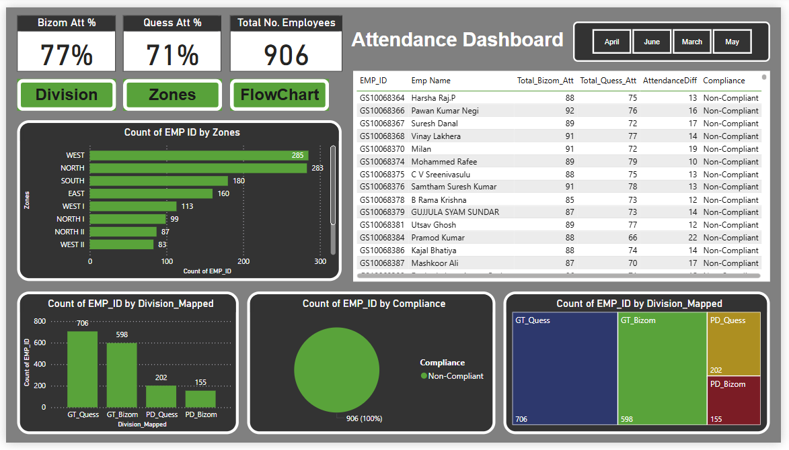

<H1>Bizom & Quess Attendance Dashboard</H1>

This repository contains a Power BI project focused on analyzing employee attendance data across multiple divisions such as GT_Bizom, GT_Quess, PD_Bizom, PD_Quess, and others. The dashboard is built to help visualize trends in attendance, identify compliance, and compare attendance metrics across different teams and zones.

<H2>Features</H2>

<ul>
<li>Division-wise and zone-wise attendance analysis</li>
<li>Comparison of Bizom vs Quess attendance</li>
<li>Monthly attendance tracking with slicers</li>
<li>Compliance vs Non-Compliance breakdown</li>
<li>Drillthrough capabilities for detailed employee view</li>
<li>Identification of employees present in one division but not in another</li>
</ul>

<H2>Tools Used</H2>

<ul>
<li>Power BI Desktop</li>
<li>Python</li>
<li>Jupyter Notebook</li>
<li>DAX (Data Analysis Expressions)</li>
<li>Power Query (M language)</li>
<li>Visual Studio</li>
<li>GitHub for version control</li></ul>

<H2>Dataset Structure</H2>

The project uses the following key tables:

<ul>
<li><b>Unified_Attendance</b>: Final unioned table containing cleaned and mapped attendance data from both Bizom and Quess</li>
<li><b>Bizom_Combined & Quess_Combined</b>: Raw attendance from different sources</li>
<li><b>DateTable2025</b>: Custom calendar table used for time-based slicing and filtering</li>
<li><b>GT_Only_Bizom, GT_Only_Quess</b>: Filtered tables to identify division-specific employees</li></ul>

<H2>Measures and KPIs</H2>

<ul>
<li><b>Total_Bizom_Att</b>: Total attendance for GT_Bizom employees</li>
<li><b>Total_Quess_Att</b>: Total attendance for GT_Quess employees</li>
<li><b>AttendanceDiff</b>: Difference between Quess and Bizom attendance</li>
<li><b>Compliance</b>: Status calculated based on attendance thresholds</li></ul>

<H2>Monthly Filters</H2>

The dashboard allows filtering by month using a slicer. Ensure that measures are dynamic and respect slicer selections.

<h2>To-Do</h2>

<ul>
<li>Add export button for attendance reports</li>
<li>Automate data refresh from OneLake or SharePoint</li>
<li>Add comments or alerts for low compliance</li>
</ul>

<h2>Insights</h2>

<ul>
<li>Easily detect non-compliant employees</li>
<li>Track monthly improvement or decline</li>
<li>Support HR and operations with clean attendance data</li></ul>

<h2>Report Pages</h2>

<ol>
<li>MainPage</li>

<ul>
<li>Purpose: Overall attendance summary.</li>
<li>Key visuals:</li>

<ul>
<li>Attendance % by Division (GT_Bizom vs GT_Quess)</li>
<li>Compliance donut chart</li>
<li>Employee-level attendance comparison</li>
<li>Division-wise bar charts</li>
</ul>
</ul>

<li>Division</li>

<ul>
<li>Purpose: Deep dive into each division’s performance.</li>
<li>Key visuals:</li>

<ul>
<li>Attendance count by division</li>
<li>Division-specific compliance charts</li>
<li>Drillthrough enabled for employee details</li>
</ul>
</ul>

<li>Zones</li>

<ul>
<li>Purpose: Track attendance zone-wise (North, South, etc.).</li>
<li>Key visuals:</li>
<ul>
<li>Count of EMP_ID by Zone</li>
<li>Performance comparison across regions</li>
</ul>
</ul>

<li>FlowChart</li>

<ul>
<li>Purpose: Process representation or flow of attendance mapping/journey.</li>
<li>Key visuals:</li>
<ul>
<li>A visual flow or logic diagram showing how data flows from raw input to clean tables (e.g., from Bizom_Combined → Unified_Attendance)</li>
</ul>
</ul>
</ol>

<h4>Author</h4>

**Shrishti Tiwari**  
Python & Power BI Developer | Automation Enthusiast